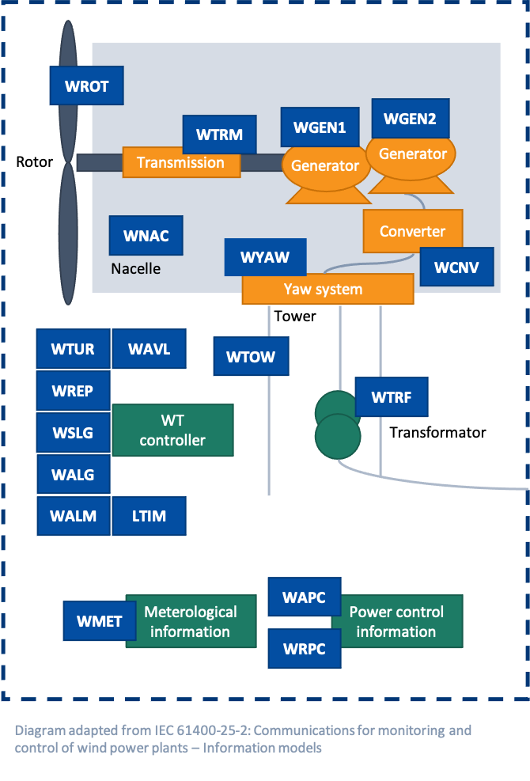

# Wind Power Plant & Wind Turbine DTDL Models

This repository includes DTDL models for wind farms and wind turbines based on the [IEC 61400-25](https://webstore.iec.ch/publication/22813) standard. These models can be used to create digital twin instances in [Azure Digital Twins](https://azure.microsoft.com/services/digital-twins/) directly or through the [XMPro](https://xmpro.com) No Code Application Development Platform.  

  

  

Example wind turbine Digital Twin in XMPro using the open-source DTDL models and data from Azure Digital Twins

## Contains

### Common Information

| File        | Description                                       |
| ----------- | ------------------------------------------------- |
| [LLN0.json](https://github.com/digitaltwinconsortium/XMPro-dtdl-data-models/blob/main/Common%20Information/LLN0.json)  | Logical Node Zero                                 |
| [LPHD.json](https://github.com/digitaltwinconsortium/XMPro-dtdl-data-models/blob/main/Common%20Information/LPHD.json)  | Physical Device Information                       |

### Wind Power Plant

| File        | Description                                       |
| ----------- | ------------------------------------------------- |
| [WPPD.json](https://github.com/digitaltwinconsortium/XMPro-dtdl-data-models/blob/main/Wind%20Power%20Plant/WPPD.json)  | Wind power plant general information              |
| [WALM.json](https://github.com/digitaltwinconsortium/XMPro-dtdl-data-models/blob/main/Wind%20Power%20Plant/WALM.json) | Wind power plant alarm information                |
| [WAPC.json](https://github.com/digitaltwinconsortium/XMPro-dtdl-data-models/blob/main/Wind%20Power%20Plant/WAPC.json) | Wind power plant active power control information |                                        
| [WMET.json](https://github.com/digitaltwinconsortium/XMPro-dtdl-data-models/blob/main/Wind%20Power%20Plant/WMET.json)  | Wind power plant meteorological information       |
| [WRPC.json](https://github.com/digitaltwinconsortium/XMPro-dtdl-data-models/blob/main/Wind%20Power%20Plant/WRPC.json)  | Wind power plant reactive power control           |

### Wind Turbine

| File        | Description                                       |
| ----------  | ------------------------------------------------- |
| [WTUR.json](https://github.com/digitaltwinconsortium/XMPro-dtdl-data-models/blob/main/Wind%20Turbine/WTUR.json)  | Wind turbine general information                  |
| [WCNV.json](https://github.com/digitaltwinconsortium/XMPro-dtdl-data-models/blob/main/Wind%20Turbine/WCNV.json)  | Wind turbine converter information                |
| [WGEN1.json](https://github.com/digitaltwinconsortium/XMPro-dtdl-data-models/blob/main/Wind%20Turbine/WGEN1.json) | Wind turbine 1 generator information              |
| [WGEN2.json](https://github.com/digitaltwinconsortium/XMPro-dtdl-data-models/blob/main/Wind%20Turbine/WGEN2.json) | Wind turbine 2 generator information              |
| [WROT.json](https://github.com/digitaltwinconsortium/XMPro-dtdl-data-models/blob/main/Wind%20Turbine/WROT.json)  | Wind turbine rotor information                    |
| [WTOW.json](https://github.com/digitaltwinconsortium/XMPro-dtdl-data-models/blob/main/Wind%20Turbine/WTOW.json)  | Wind turbine tower information                    |
| [WTRF.json](https://github.com/digitaltwinconsortium/XMPro-dtdl-data-models/blob/main/Wind%20Turbine/WTRF.json)  | Wind turbine transformer information              |
| [WTRM.json](https://github.com/digitaltwinconsortium/XMPro-dtdl-data-models/blob/main/Wind%20Turbine/WTRM.json)  | Wind turbine transmission information             |
| [WYAW.json](https://github.com/digitaltwinconsortium/XMPro-dtdl-data-models/blob/main/Wind%20Turbine/WYAW.json)  | Wind turbine yawing information                   |
| [WNAC.json](https://github.com/digitaltwinconsortium/XMPro-dtdl-data-models/blob/main/Wind%20Turbine/WNAC.json)  | Wind turbine nacelle information                  |
| [WAVL.json](https://github.com/digitaltwinconsortium/XMPro-dtdl-data-models/blob/main/Wind%20Turbine/WAVL.json)  | Wind turbine availability information             |

### Not Supported*

| File        | Description                                       |
| ----------  | ------------------------------------------------- |
| [WALG.json](https://github.com/digitaltwinconsortium/XMPro-dtdl-data-models/blob/main/Not%20Supported/WALG.json)  | Wind turbine analogue log information             |
| [WSLG.json](https://github.com/digitaltwinconsortium/XMPro-dtdl-data-models/blob/main/Not%20Supported/WSLG.json) | Wind turbine state log information                |
| [WREP.json](https://github.com/digitaltwinconsortium/XMPro-dtdl-data-models/blob/main/Not%20Supported/WREP.json)  | Wind turbine report information                   |

*These files are currently not supported in Azure Digital Twin, but can be used in Time Series Insights and XMPro.

## Support

This repository was created by @XMPro in collaboration with the [Digital Twin Consortium](https://www.digitaltwinconsortium.org). For assistance or feature requests, contact support@xmpro.com.
