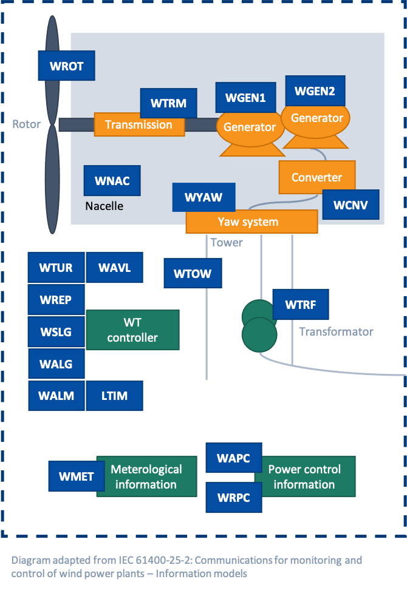

# Wind Power Plant & Wind Turbine DTDL Models

This repository includes DTDL models for wind farms and wind turbines based on the [IEC 61400-25](https://webstore.iec.ch/publication/22813) standard. These models can be used to create digital twin instances in [Azure Digital Twins](https://azure.microsoft.com/services/digital-twins/) directly or through the [XMPro](https://xmpro.com) No Code Application Development Platform.  

  

  

Example wind turbine Digital Twin in XMPro using the open-source DTDL models and data from Azure Digital Twins

## Contains

### Common Information

| File        | Description                                       |
| ----------- | ------------------------------------------------- |
| [LLN0.json](https://github.com/digitaltwinconsortium/XMPro-dtdl-data-models/blob/main/Common%20Information/LLN0.json)  | Logical Node Zero                                 |
| LPHD.json  | Physical Device Information                       |

### Wind Power Plant

| File        | Description                                       |
| ----------- | ------------------------------------------------- |
| WPPD.json  | Wind power plant general information              |
| WALM.json  | Wind power plant alarm information                |
| WAPC.json  | Wind power plant active power control information |                                                
| WMET.json  | Wind power plant meteorological information       |
| WRPC.json  | Wind power plant reactive power control           |

### Wind Turbine

| File        | Description                                       |
| ----------  | ------------------------------------------------- |
| WTUR.json  | Wind turbine general information                  |
| WCNV.json  | Wind turbine converter information                |
| WGEN1.json | Wind turbine 1 generator information              |
| WGEN2.json | Wind turbine 2 generator information              |
| WROT.json  | Wind turbine rotor information                    |
| WTOW.json  | Wind turbine tower information                    |
| WTRF.json  | Wind turbine transformer information              |
| WTRM.json  | Wind turbine transmission information             |
| WYAW.json  | Wind turbine yawing information                   |
| WNAC.json  | Wind turbine nacelle information                  |
| WAVL.json  | Wind turbine availability information             |

### Not Supported*

| File        | Description                                       |
| ----------  | ------------------------------------------------- |
| WALG.json  | Wind turbine analogue log information             |
| WSLG.json  | Wind turbine state log information                |
| WREP.json  | Wind turbine report information                   |

*These files are currently not supported in Azure Digital Twin, but can be used in Time Series Insights and XMPro.

## Support

This repository was created by @XMPro in collaboration with the [Digital Twin Consortium](https://www.digitaltwinconsortium.org). For assistance or feature requests, contact support@xmpro.com.
